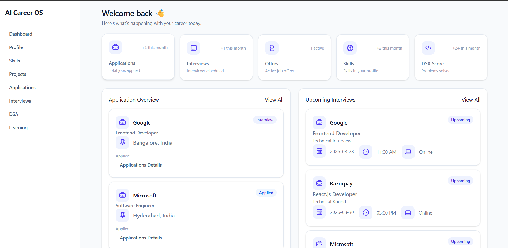
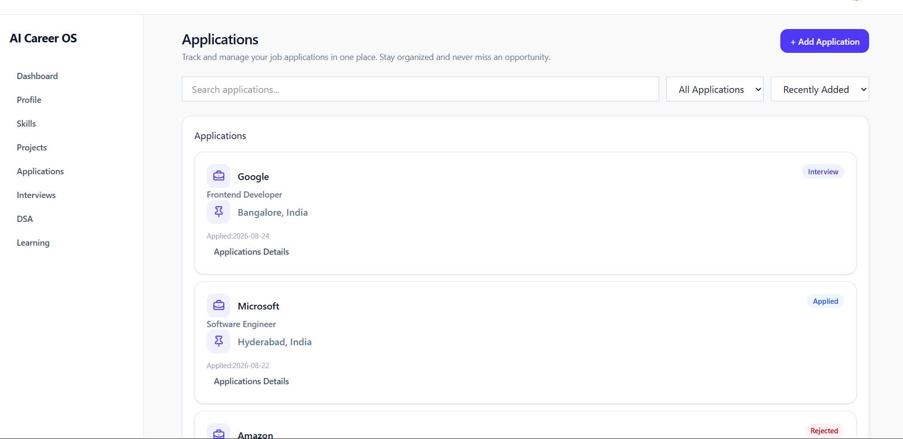
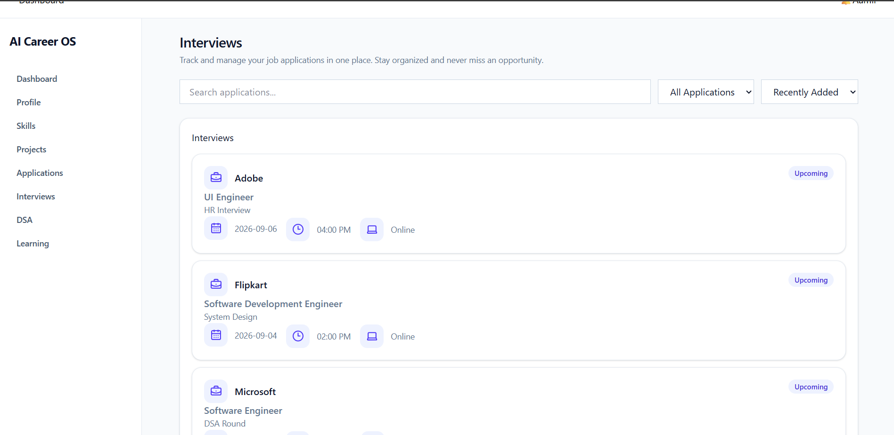
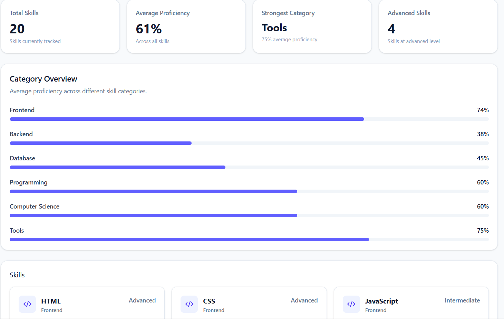
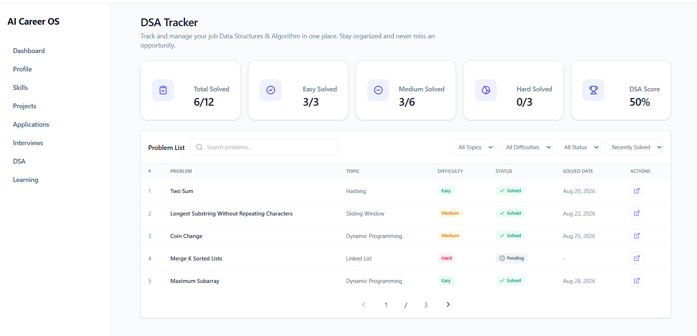
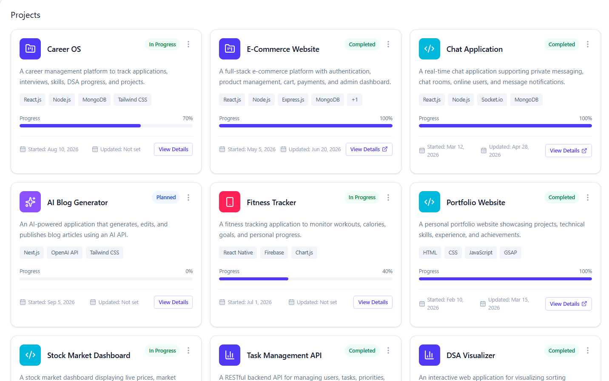

# 🚀 Career OS

> A modern career management dashboard designed to help developers organize and track their job applications, interviews, technical skills, DSA progress, and projects — all in one place.

Career OS is a frontend-first career management platform built with React.js and Tailwind CSS. The application provides a centralized dashboard where users can monitor different aspects of their career preparation and job search journey.

The project is designed with a scalable architecture so that backend services, authentication, database persistence, and AI-powered career assistance can be integrated in future versions.

---
## 📸 Screenshots

### Dashboard



### Application Tracker



### Interview Tracker



### Skills Tracker



### DSA Tracker



### Project Tracker




## ✨ Features

### 📊 Dashboard

A centralized overview of the user's career activity.

- Application statistics
- Interview statistics
- Offer tracking
- Skill overview
- DSA score
- Application overview
- Upcoming interviews
- Recent activity
- Quick career progress insights

---

### 💼 Application Tracker

Manage and monitor job applications from a single interface.

- View all applications
- Search applications
- Filter by application status
- Sort applications by date
- Application cards
- Application details page
- Dynamic application routes
- Empty-state handling
- Add application interface

Supported application statuses:

- Applied
- Interview
- Offer
- Rejected

---

### 🗓️ Interview Tracker

Track upcoming and completed interviews.

- Interview schedule
- Company information
- Position
- Interview date and time
- Interview type
- Interview mode
- Interview status
- Search interviews
- Filter interviews
- Sort interviews
- Interview progress overview

Supported interview statuses:

- Upcoming
- Completed
- Cancelled

---

### 🧠 Skills Tracker

Track technical skills and monitor proficiency.

- Skill cards
- Skill categories
- Skill levels
- Progress percentage
- Search skills
- Filter by category
- Filter by skill level
- Sort skills
- Average proficiency calculation
- Strongest category calculation
- Advanced skill statistics
- Category-wise proficiency overview

Skill levels:

- Beginner
- Intermediate
- Advanced

---

### 💻 DSA Tracker

Track Data Structures and Algorithms preparation.

- Total problems solved
- Easy problems
- Medium problems
- Hard problems
- DSA score
- Topic-wise progress
- Problem history
- Search problems
- Filter by topic
- Filter by difficulty
- Filter by status
- Sorting and organization of problems

Example DSA topics:

- Arrays
- Strings
- Hashing
- Two Pointers
- Sliding Window
- Binary Search
- Linked List
- Stack & Queue
- Trees
- Graphs
- Greedy
- Dynamic Programming

---

### 📁 Project Tracker

Track personal and development projects.

- Project cards
- Project descriptions
- Project categories
- Technologies used
- Project status
- Project progress
- Start and end dates
- GitHub repository links
- Live project links
- Search projects
- Filter projects
- Sort projects
- Project details

Supported project statuses:

- Planning
- In Progress
- Completed
- Archived

---

## 🎨 UI & UX

Career OS focuses on providing a clean and responsive user experience.

### Responsive Design

The application is designed to work across:

- Desktop
- Laptop
- Tablet
- Mobile

### UI Principles

- Clean dashboard layout
- Reusable components
- Consistent spacing
- Responsive grids
- Interactive cards
- Progress indicators
- Status badges
- Empty states
- Clear navigation
- Accessible form controls

---

## 🛠️ Tech Stack

### Frontend

- React.js
- JavaScript
- Tailwind CSS
- React Router
- Vite

### Icons

- Lucide React

### Current Data Layer

The current frontend uses structured mock data stored in JavaScript files.

Example:

```text
src/
└── Data/
    ├── mockData.js
    ├── ApplicationData.js
    ├── InterviewData.js
    ├── SkillData.js
    ├── DSAData.js
    └── ProjectData.js
